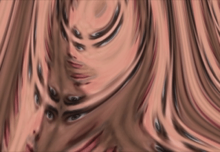

<h1 align="center">React Shader Plane 🔮</h1>

Initializes a Canvas with a MeshBasicMaterial on an orthographic plane.

### Example



```js
export default function App() {
  let [tex] = useState(new TextureLoader().load(alyx));

  useEffect(() => {
    if (tex) {
      tex.wrapS = MirroredRepeatWrapping;
      tex.wrapT = MirroredRepeatWrapping;
    }
  }, [tex]);

  return (
    <>
      <div
        style={{
          position: "fixed",
          top: 0,
          left: 0,
          width: "100%",
          height: "100%"
        }}
      >
        <ShaderPlane
          map={tex}
          onFrame={shader => {
            // do something
          }}
          functions={`
            // Simplex 2D noise
            //
            vec3 permute(vec3 x) { return mod(((x*34.0)+1.0)*x, 289.0); }

            float snoise(vec2 v){
              const vec4 C = vec4(0.211324865405187, 0.366025403784439,
                      -0.577350269189626, 0.024390243902439);
              vec2 i  = floor(v + dot(v, C.yy) );
              vec2 x0 = v -   i + dot(i, C.xx);
              vec2 i1;
              i1 = (x0.x > x0.y) ? vec2(1.0, 0.0) : vec2(0.0, 1.0);
              vec4 x12 = x0.xyxy + C.xxzz;
              x12.xy -= i1;
              i = mod(i, 289.0);
              vec3 p = permute( permute( i.y + vec3(0.0, i1.y, 1.0 ))
              + i.x + vec3(0.0, i1.x, 1.0 ));
              vec3 m = max(0.5 - vec3(dot(x0,x0), dot(x12.xy,x12.xy),
                dot(x12.zw,x12.zw)), 0.0);
              m = m*m ;
              m = m*m ;
              vec3 x = 2.0 * fract(p * C.www) - 1.0;
              vec3 h = abs(x) - 0.5;
              vec3 ox = floor(x + 0.5);
              vec3 a0 = x - ox;
              m *= 1.79284291400159 - 0.85373472095314 * ( a0*a0 + h*h );
              vec3 g;
              g.x  = a0.x  * x0.x  + h.x  * x0.y;
              g.yz = a0.yz * x12.xz + h.yz * x12.yw;
              return 130.0 * dot(m, g);
            }
          `}
          fragmentShader={`
            vec2 uv2 = vUv * 1. * snoise(vUv + uTime * .0001) * 10.;

            diffuseColor = texture2D(map, uv2);
          `}
        />
        ;
      </div>
    </>
  );
}
```